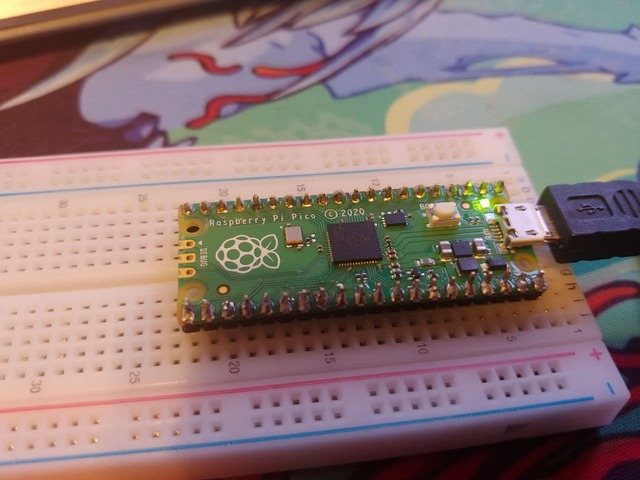

# LED Blink

Perhaps one of the simplest projects you can build for the Pico is the LED Blink project. This small snippet of code enables the board to intermittently flash the onboard LED on and off.

## In order to complete this project, you will need the following: 
1 x Raspberry Pi Pico
1 x Micro USB cable

### Before running please follow the [official documentation](https://www.raspberrypi.org/documentation/pico/getting-started/) on how to install MicroPython to your device. 

## How to run
**1.** Hold the Pico's onboard power button and connect it to your computer via a micro USB cable, your device should show up as removable storage. 

**2.** Download the <a id="raw-url" href="https://github.com/Steven-Klavins/Pico-Experimentation/blob/main/LED%20Blink/main.py">code</a> and copy it to your device (ensure the file name remains 'main.py' as it will fail to run in the event its name something else).

**3.** Tap the power button on your Pico board to soft reboot and you're done! The onboard LED will now continuously flash on and off every 0.5 seconds.

## How it works:

### Imported libraries:

**Pin** is imported for the handling of I/O pins (input and output).

**Time** provides various time-related functions, in our use case, sleep (the suspension of executing code).

### The code:

First, we assign our pin for use with `led = Pin(25, Pin.OUT)` For our use case, Pin only needs two arguments, the pin number (`25` the pin assigned for the Pico's LED) and `Pin.OUT` to assign this pin as an output.

`while True :` is where our loop begins (true always being true this loop will run indefinitely unless changed). Within the loop, we toggle the pin on with `led.toggle()`, suspend the executing code for 0.5 seconds with `sleep(0.5)` and the cycle continues. 

